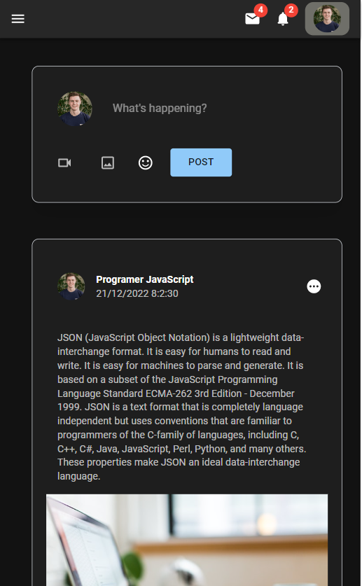
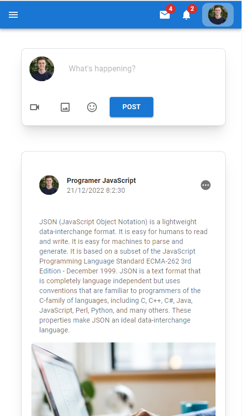

# Social Network App

fully functional social network app with react.js and firebase as a backend endpoint and tailwind CSS for styling and MUI  dark mode

## Learning Objectives

 - Firebase Auth
 - Firebase storage
 - Context API
 - CRUD operation
 - Tailwind CSS
 - Custom Hooks
 - Material UI
 - Dark Mode
 - Protected Routes
 - Responsive Design

## Demo

You can see the project live here [Vist this Site](https://social-network-app-rho.vercel.app/).

## App Preview

